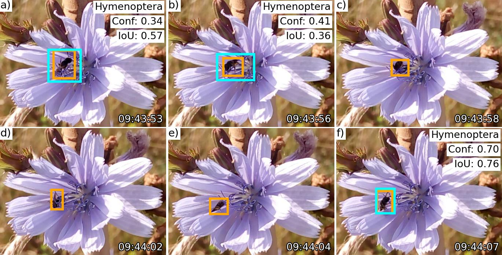

# Overview

This repository hosts the source code accompanying the research paper:

> Ștefan V., Stark T., Wurm M., Taubenböck H., Knight T.M. (2025). Successes and limitations of pretrained YOLO detectors applied to unseen time-lapse images for automated pollinator monitoring. Preprint (Version 1) available at Research Square, URL: https://www.researchsquare.com/article/rs-6335312/v1 DOI: https://doi.org/10.21203/rs.3.rs-6335312/v1



A time-lapse image showing insect detection in smartphone-captured images, using NMS-optimized pre-trained YOLO models that were trained on citizen science datasets (e.g., from iNaturalist, Observation.org).

This GitHub Repository is archived on Zenodo: [](https://doi.org/10.5281/zenodo.15127689)

## How to use this repository

You have two options for accessing this repository: `git clone` or download it directly.

To clone the repository, ensure that [git][1] is installed, then run the following command in your terminal:
```
git clone https://github.com/valentinitnelav/smartphone-insect-detect.git
```

Next steps:

- Navigate to `./envs/README.md` for instructions on setting up the required Python and R environments.
- Refer to `./data/README.md` for instructions on downloading the dataset from Zenodo and details on data processing.
- Consult `./code/README.md` for instructions on intermediary processes and model evaluation.
- Check out `./analysis/README.md` for instructions on conducting the data analysis.

# Data

The image dataset is stored on Zenodo at:

> Ştefan, V., Workman, A., Cobain, J. C., Rakosy, D., Wild Stoykova, B., Cyranka, E., Urrego Álvarez, R., & Knight, T. (2025). Dataset of arthropod flower visits captured via smartphone time-lapse photography [Data set]. Zenodo. https://doi.org/10.5281/zenodo.15096610

Check `./data/README.md` for more information on how to download the dataset and the data processing steps.

# Scripts and notebooks

Scripts and notebooks are organized as follows:

1. `./data/code/`: Ground truth data processing. See `./data/README.md`;
2. `./code/`: intermediary processes to model evaluation. See `./code/README.md`;
3. `./analysis/`: analysis of the results produced by the optimized detector, along with data descriptors, visualizations, and statistical tests. See `./analysis/README.md`.

# Reproducibility & Virtual Environments

For Python & R environments, see `./envs/README.md`.

This project was developed on Linux using open-source software for the following reasons:

- GPU Compatibility: The GPU workstation and cluster we had access to run on Linux,
- Costs & Open-Source benefits: Linux is free and open-source, enhancing accessibility and transparency. This aligns with our project's commitment to open science and the [FAIR principles][2], allowing others to engage with, review, build upon, and redistribute our work.

[1]: https://git-scm.com/downloads
[2]: https://www.go-fair.org/fair-principles/